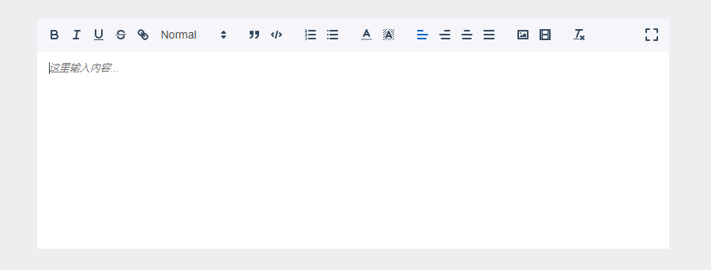

## MQuillEditor

A quill editor component for vue.

[Example](https://mengdu.github.io/m-quill-editor/example/)




npm

```ls
npm install vue-m-quill-editor
```

use

```js
import MQuillEditor from 'vue-m-quill-editor'

Vue.use(MQuillEditor)
```


```js
<template>
  <m-quill-editor 
    :width="quill.width"
    :has-border="quill.border"
    v-model="quill.content"
    :sync-output="quill.syncOutput"
    :theme="quill.theme"
    :disabled="quill.disabled"
    :fullscreen="quill.full"
    @upload="upload"
    ></m-quill-editor>
</template>
<script>
import MQuillEditor from 'm-quill-editor'
export default {
  components: {
    MQuillEditor
  },
  data () {
    return {
      pkg,
      quill: {
        width: 800,
        border: false,
        content: 'wellcome ~',
        syncOutput: false,
        theme: 'snow', //bubble snow
        disabled: false,
        full: false,
        toolbar: [
          [{ 'header': 1 }, { 'header': 2 }],
          ['bold', 'italic', 'underline', 'strike', 'link']
        ]
      }
    }
  },
  methods: {
    upload (file, insert) {
      console.log(file)
      insert('https://avatars0.githubusercontent.com/u/11366654?s=460&v=4', 'center')
    }
  }
}
</script>
```


## MQuillEditor Attributes

| 参数      | 说明    | 类型      | 可选值       | 默认值   |
|---------- |-------- |---------- |-------------  |-------- |
| value     | 内容    | string    | — | —  |
| width     | 宽度    | number    | — | —  |
| height     | 高度    | number    | — | —  |
| placeholder     | 占位符    | string    | — | 在这里输入内容...  |
| toolbar     | 工具栏配置    | object    | — |   |
| zIndex     | 编辑器z-index值    | string    | — |  1000 |
| fullscreen     | 是否全屏    | boolean    | true/false |  false |
| syncOutput     | 是否同步value（同步到v-model）    | boolean    | true/false |  false |
| theme     | 主题    | string    | bubble/snow |  snow |
| has-border     | 是否显示边框    | boolean    | true/false |  false |
| disabled     |   禁用  | boolean    | true/false |  false |
| img-accept     |   图片输入框 `accept` 属性  | string    | — | 空 |


**toolbar:**

```js
[
  // [{ 'font': fonts }],
  // [{'size': ['small', false, 'large', 'huge']}],
  ['bold', 'italic', 'underline', 'strike', 'link', {'header': [1, 2, 3, 4, 5, 6, false]}],
  // [{ 'header': 1 }, { 'header': 2 }],
  // [{'header': [1, 2, 3, 4, 5, 6, false]}],
  ['blockquote', 'code-block'],
  [{'list': 'ordered'}, {'list': 'bullet'}],
  // [{ 'script': 'sub'}, { 'script': 'super' }],
  // [{ 'indent': '-1'}, { 'indent': '+1' }],
  // [{ 'direction': 'rtl' }],
  [{'color': []}, {'background': []}],
  // [{align: []}],
  // [{ 'align': [false, 'right', 'center', 'justify'] }],
  [{align: ''}, {align: 'right'}, {align: 'center'}, {align: 'justify'}],
  ['image', 'video'],
  ['clean']
]
```

## MQuillEditor Events

| 事件      | 说明    |参数   |
|---------- |-------- |----------|
| init     | 初始化   | quill, MQuillEditor |
| blur     | 失去焦点   | —  |
| focus     | 获取焦点   | —  |
| change | 内容改变   | —  |
| upload | 选择图片   | File, quill.insertImage  |


## MQuillEditor Methods

| 名称      | 说明    |参数   |
|---------- |-------- |----------|
| setContent     | 设置html   | html |
| getContent     | 获取html   |  |
| setDisabled     | 禁用   |  |


## other

[Quill](https://quilljs.com/)

[Quill Github](https://github.com/quilljs/quill)

[Quill API](https://quilljs.com/docs/quickstart/)
